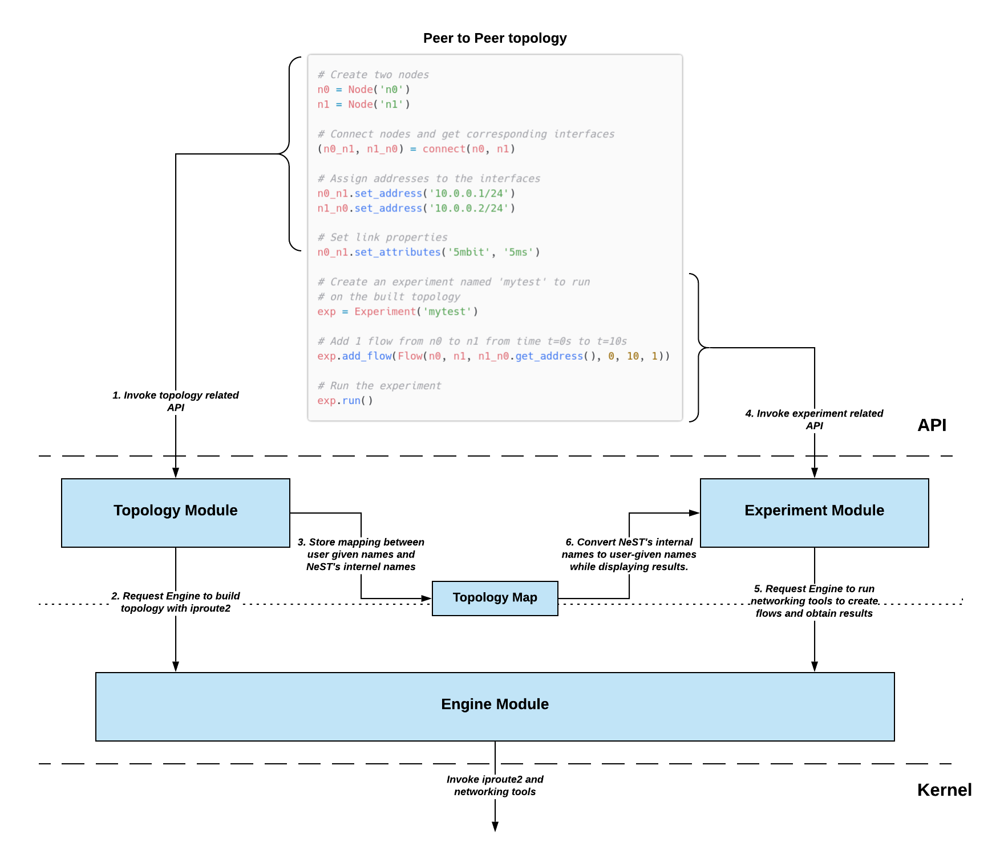

.. SPDX-License-Identifier: GPL-2.0-only
   Copyright (c) 2019-2021 NITK Surathkal

Architecture
============

This section will introduce to you the core modules of NeST. These were one of
the first modules to be added to NeST, and any new modules that are added and
might be added in the future mostly extend these core modules. These modules
are::

   1. Topology Module
   2. Experiment Module
   3. Engine Module

Additionally, we will also look into a small but important module called
``Topology Map``.

The below image shows the interaction among these modules:

Topology Module
---------------

The topology module consists of APIs for creation, management and deletion of
network namespace, network interfaces, addresses and routes. Network namespaces
isolate network resources. We use this isolation to emulate ``Nodes`` in the
network.

In NeST, a node is an abstraction for a computing device that can communicate
with other nodes. Nodes can communicate with other nodes using ``Interfaces``.
An interfaces can be assigned network addresses (i.e., IPv4 or IPv6 addresses).
Using these addresses, two interfaces directly connected with one another can
communicate. If not, then we can add routes to interfaces to ensure that
non-adjacent interfaces can communicate. You can refer to :ref:`tutorial`
section for more details on these APIs.

Experiment Module
-----------------

The experiment module consists of APIs for running network experiments. A
network experiment consists of APIs for generating network traffic. This traffic
is run on topologies built using toplogy module, in the aim of understanding
some networking phenomena (for eg., to understand TCP BBR's behaviour of probing
RTT every 10s). Network traffic is generated by using network utilities such as
``netperf``, ``iperf3``.

Additionally, experiment module has ``Parsers`` and ``Plotters``. ``Parsers``
run ``iproute2`` tools like ``ss`` (socket stats), ``tc`` (traffic control) at
regular intervals to obtain crucial network data (like TCP CWND, Qdisc queue
lenght, etc). This data is obtained by parsing the output of ss and tc.
``Plotters`` use these parsed result to produce plots.

It is expected that this data visualized as plot would be more useful for the
user. But the less readable parsed result is also available to the user in JSON
format, in case they are interested to visualize data in their own way.

Engine Module
-------------

From the above two modules and the :ref:`introduction to developer docs`
section, it is quite clear that NeST is a wrapper around network namespaces and
network utilities. This implies the NeST inherently has lot of dependencies over
networking tools. To keep track of all these depenedencies, and to make it
easier to add new dependencies, we use the engine module.

Put simply, engine module consists of python APIs that internally call the
networking tools. The topology and experiment module use these APIs. For
example, below is the command to create a network namespace in linux:

.. code-block:: console

   $ ip netns add node

In engine, we have a function called ``create_ns``, which internally calls the
above command. The ``create_ns`` API is used by topology module, in the
constructor of the ``Node`` class.

Note that the engine module APIs are considered to be "low-level", which means
it is not intended to be used by users. They are primarily used by "high-level"
modules, like topology and experiment. The APIs exposed by topology and
experiment are used by users.

Topology Map
------------

Topology map assigns unique ids to the topology created by the user. What this
ensures is that no to networking entities (eg. network namespaces, network
interfaces) will have the same id. This allows the user to build multiple copies
of the same topology and run different experiments on them.
